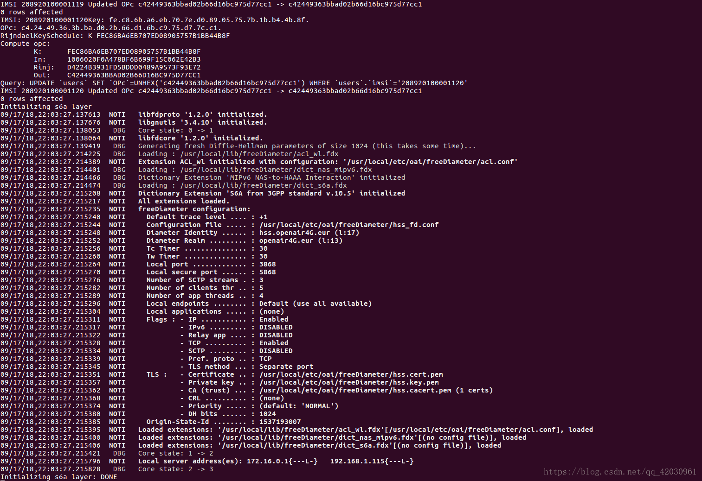
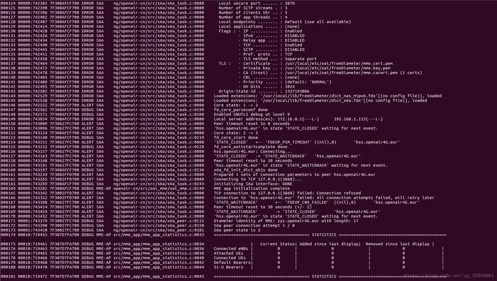
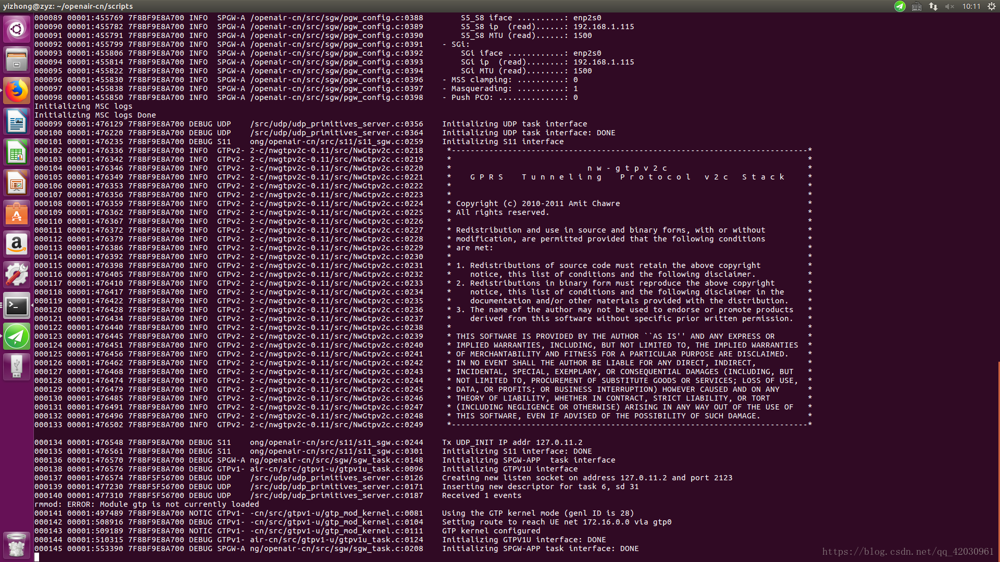

# 1 前期准备（Ubuntu16.04.3,Linux kernel 4.15.0）

## 1.1 设置root密码与主机名

```
- sudo passwd root	# 设置root密码
- sudo hostnamectl set-hostname epc	# 若主机名不为 epc，则设置主机名为 epc，重启有效
```

> 注：若主机名设为其他，则后面章节的相应配置也将修改

## 1.2 更换国内软件源

> 系统设置 -> 软件与更新 -> ubuntu 软件 -> 下载自：[...] -> 选择阿里云镜像站

## 1.3 设置root用户自动登录与TAB自动补全

```
 - sudo gedit /etc/lightdm/lightdm.conf
 # 修改后的内容：
     [Seat:*]
    autoloin-guest=false
    autologin-user=root
    autologin-user-timeout=0
    allow-gust=false
    
- sudo gedit /root/.profile		# 找到 mesg n 这一行，修改为：tty -s && mesg n
- sudo gedit /etc/bash.bashrc
# 找到以下内容，并对除第一行以外的代码取消注释：
    # enable bash completion in interactive shells  
    #if ! shopt -oq posix; then  
    # if [ -f /usr/share/bash-completion/bash_completion ]; then  
    #    . /usr/share/bash-completion/bash_completion  
    #  elif [ -f /etc/bash_completion ]; then  
    #    . /etc/bash_completion  
    #  fi  
    #fi 

- sudo reboot # 重启后检查是否为 root 用户
```

## 1.4 配置内核

> 注：官网要求高于4.7以上版本的内核，本文使用 4.15.0的内核

### 1.4.1 查看内核版本

```
uname -a	# 若内核为 4.15.0 可不用更换内核
```

### 1.4.2  下载并安装内核文件

```
# 下载内核文件
- wget https://kernel.ubuntu.com/~kernel-ppa/mainline/v4.15/linux-headers-4.15.0-041500_4.15.0-041500.201802011154_all.deb
- wget https://kernel.ubuntu.com/~kernel-ppa/mainline/v4.15/linux-headers-4.15.0-041500-generic_4.15.0-041500.201802011154_amd64.deb
- wget https://kernel.ubuntu.com/~kernel-ppa/mainline/v4.15/linux-image-4.15.0-041500-generic_4.15.0-041500.201802011154_amd64.deb
# 安装内核,并重启生效
- dpkg -i *.deb
- reboot
```

## 1.5 设置静态IP

> 1. 记录当前默认被分配的 ip与掩码信息等
> 2. 将网络设为静态，信息与之前一致即可

# 2 开始安装EPC

## 2.1 配置 /etc/hosts文件

```
- gedit /etc/hosts
# 添加以下内容： 
    127.0.1.1	epc.openair4G.eur	epc
    127.0.1.1	hss.openair4G.eur	hss

    151.101.229.176	cdn.kernel.org
    193.55.113.249  gitlab.eurecom.fr
    172.65.251.78   gitlab.com
    151.101.76.133  raw.githubusercontent.com
    140.82.114.3    github.com
    151.101.40.249  github.global.ssl.fastly.net
    91.189.94.216	kernel.ubuntu.com

- sudo hostname -f	# 查看长主机名是否为 epc.openair4G.eur
```

> 因 “127.0.1.1	epc.openair4G.eur	epc”  已包括对 epc 的解析，故可删除原  “ 127.0.0.1	epc ” 行，

## 2.2 安装必要软件

```
# 更新
- apt update

# 安装运维工具
- apt install -y subversion git vim wget openssh-server  

# 安装 mysql,把root密码设置为 linux
- apt install -y mysql-server mysql-client 

# 安装  apache2 与 php
- apt install -y apache2 php7.0 libapache2-mod-php7.0 
 
# 安装 phpmyadmin，用户名为 root，设置密码为 linux
# 安装后可浏览 http://127.0.0.1/phpmyadmin 查看是否安装成功
- apt install -y phpmyadmin
- ln -s /etc/phpmyadmin/apache.conf /etc/apache2/conf-available/phpmyadmin.conf
- a2enconf phpmyadmin
- systemctl restart apache2 

# 加载 GTP 内核模块
- modprobe gtp
```

> 注：本文的 mysql 与 phpmyadmin 的密码统一设为 linux

## 2.3 获取 openair-cn 代码

	# 若有 gitlab 账号：
	- git clone https://gitlab.eurecom.fr/oai/openair-cn.git ~/	# 克隆代码用户目录下
	- cd ~/openair-cn && git checkout develop	# 切换到 develop 分支
	
	# 若无 gitlab 账号：
	- wget -P ~/ https://github.com/Ranguo956/notes/blob/main/OAI_EPC/openair-cn.tar.gz 
	- tar zxvf ~/openair-cn.tar.gz
	- cd ~/openair-cn && git checkout develop	# 切换到 develop 分支

## 2.4 配置环境变量

```
# 打开配置文件
- gedit /etc/bash.bashrc
# 在文件末尾追加以下内容：
	export OPENAIRCN_DIR=/root/home/openair-cn
```

> 注：若不在用户目录克隆源码，则将 OPENAIRCN_DIR 更改为 自己的源码目录

## 2.5 安装编译组件的依赖包

```
- cd ~/openair-cn/scripts/
- ./build_mme -i 
- ./build_hss -i 
- ./build_spgw -i
```

## 2.6 配置EPC

### 2.6.1 准备 EPC 配置文件

```
- mkdir -p /usr/local/etc/oai/freeDiameter
- cp ~/openair-cn/etc/mme.conf /usr/local/etc/oai
- cp ~/openair-cn/etc/hss.conf /usr/local/etc/oai
- cp ~/openair-cn/etc/spgw.conf /usr/local/etc/oai
- cp ~/openair-cn/etc/acl.conf /usr/local/etc/oai/freeDiameter
- cp ~/openair-cn/etc/mme_fd.conf /usr/local/etc/oai/freeDiameter
- cp ~/openair-cn/etc/hss_fd.conf /usr/local/etc/oai/freeDiameter
```

### 2.6.2 配置MME

```
- gedit /usr/local/etc/oai/mme.conf
# 核对与修改成以下信息:
REALM = "openair4G.eur";

    S6A :
    {
        S6A_CONF                   = "/usr/local/etc/oai/freeDiameter/mme_fd.conf"; # YOUR MME freeDiameter config file path
        HSS_HOSTNAME               = "hss";                                         # THE HSS HOSTNAME
    };

GUMMEI_LIST = ( 
        {MCC="208" ; MNC="93"; MME_GID="4" ; MME_CODE="1"; }                   # YOUR GUMMEI CONFIG HERE
     );

TAI_LIST = (
{MCC="208" ; MNC="93";  TAC = "1"; }                              # YOUR PLMN CONFIG HERE
);

   NETWORK_INTERFACES :
    {
        # MME binded interface for S1-C or S1-MME  communication (S1AP), can be ethernet interface, virtual ethernet interface, we don't advise wireless interfaces
        MME_INTERFACE_NAME_FOR_S1_MME         = "enp2s0";                        # YOUR NETWORK CONFIG HERE
        MME_IPV4_ADDRESS_FOR_S1_MME           = "10.16.65.195/17";            # YOUR NETWORK CONFIG HERE

        # MME binded interface for S11 communication (GTPV2-C)
        MME_INTERFACE_NAME_FOR_S11_MME        = "lo";                          # YOUR NETWORK CONFIG HERE
        MME_IPV4_ADDRESS_FOR_S11_MME          = "127.0.11.1/8";                # YOUR NETWORK CONFIG HERE
        MME_PORT_FOR_S11_MME                  = 2123;                          # YOUR NETWORK CONFIG HERE
    };

S-GW :
{
    # S-GW binded interface for S11 communication (GTPV2-C), if none selected the ITTI message interface is used
    SGW_IPV4_ADDRESS_FOR_S11                = "127.0.11.2/8";            # YOUR NETWORK CONFIG HERE

};
```

> 主要修改：
>
> MME_INTERFACE_NAME_FOR_S1_MME       =    “enp2s0”;
> MME_IPV4_ADDRESS_FOR_S1_MME             =    “10.16.65.195/17”;

### 2.6.3 配置 SPGW

```
- gedit /usr/local/etc/oai/spgw.conf
# 修改与核对以下内容：
S-GW :
{
    NETWORK_INTERFACES : 
    {
        # S-GW binded interface for S11 communication (GTPV2-C), if none selected the ITTI message interface is used
        SGW_INTERFACE_NAME_FOR_S11              = "lo";                        # YOUR NETWORK CONFIG HERE
        SGW_IPV4_ADDRESS_FOR_S11                = "127.0.11.2/8";              # YOUR NETWORK CONFIG HERE

        # S-GW binded interface for S1-U communication (GTPV1-U) can be ethernet interface, virtual ethernet interface, we don't advise wireless interfaces
        SGW_INTERFACE_NAME_FOR_S1U_S12_S4_UP    = "enp2s0";                       # YOUR NETWORK CONFIG HERE, USE "lo" if S-GW run on eNB host
        SGW_IPV4_ADDRESS_FOR_S1U_S12_S4_UP      = "10.16.65.195/17";           # YOUR NETWORK CONFIG HERE
        SGW_IPV4_PORT_FOR_S1U_S12_S4_UP         = 2152;                         # PREFER NOT CHANGE UNLESS YOU KNOW WHAT YOU ARE DOING

        # S-GW binded interface for S5 or S8 communication, not implemented, so leave it to none
        SGW_INTERFACE_NAME_FOR_S5_S8_UP         = "none";                       # DO NOT CHANGE (NOT IMPLEMENTED YET)
        SGW_IPV4_ADDRESS_FOR_S5_S8_UP           = "0.0.0.0/24";                 # DO NOT CHANGE (NOT IMPLEMENTED YET)
    };
...
}


P-GW =
{
    NETWORK_INTERFACES :
    {
        # P-GW binded interface for S5 or S8 communication, not implemented, so leave it to none
        PGW_INTERFACE_NAME_FOR_S5_S8          = "none";                         # DO NOT CHANGE (NOT IMPLEMENTED YET)
        PGW_IPV4_ADDRESS_FOR_S5_S8            = "0.0.0.0/24";                   # DO NOT CHANGE (NOT IMPLEMENTED YET)

        # P-GW binded interface for SGI (egress/ingress internet traffic)
        PGW_INTERFACE_NAME_FOR_SGI            = "enp2s0";                         # YOUR NETWORK CONFIG HERE
        PGW_IPV4_ADDRESS_FOR_SGI              = "10.16.65.195/17"                 #Add this yourself             
        PGW_MASQUERADE_SGI                    = "yes";                          # YOUR NETWORK CONFIG HERE
       UE_TCP_MSS_CLAMPING                    = "no";                           # STRING, {"yes", "no"}.

    };
...
   # DNS address communicated to UEs
    DEFAULT_DNS_IPV4_ADDRESS     = "8.8.8.8";                            # YOUR NETWORK CONFIG HERE
    DEFAULT_DNS_SEC_IPV4_ADDRESS = "8.8.4.4";                            # YOUR NETWORK CONFIG HERE

...
}
```

> 主要修改：
>
> SGW_INTERFACE_NAME_FOR_S1U_S12_S4_UP      =    “enp2s0”;
>
> SGW_IPV4_ADDRESS_FOR_S1U_S12_S4_UP            =   "10.16.65.195/17";
>
> PGW_INTERFACE_NAME_FOR_SGI                            =    "enp2s0";
>
> PGW_MASQUERADE_SGI                                           =     "yes";  
>
> 添加：
>
> PGW_IPV4_ADDRESS_FOR_SGI                                 =    "10.16.65.195/17";         

### 2.6.4 配置 HSS freediameter 

```
- gedit /usr/local/etc/oai/freeDiameter/hss_fd.conf
# 确认信息：
Identity = "hss.openair4G.eur";
Realm = "openair4G.eur";
```

### 2.6.5 配置 MME freediameter

```
- gedit /usr/local/etc/oai/freeDiameter/mme_fd.conf
# 修改和确认信息：
Identity = "epc.openair4G.eur";
Realm = "openair4G.eur";
ConnectPeer= "hss.openair4G.eur" { ConnectTo = "127.0.0.1"; No_SCTP ; No_IPv6; Prefer_TCP; No_TLS; port = 3868;  realm = "openair4G.eur";};
```

### 2.6.5 配置 HSS

```
- gedit /usr/local/etc/oai/hss.conf
#修改和确认以下信息：
    MYSQL_user   = "root"; 
    MYSQL_pass   = "linux"; #Put here the root password of mysql database that was provided during installation
    OPERATOR_key = "1006020f0a478bf6b699f15c062e42b3"; # OP key for oai_db.sql, Must match to that of UE Sim card, OP_Key
```

> 其中 OPERATOR_key 可以先不管，用这个默认的就可以，是后面 SIM 卡相关信息。

## 2.7 运行EPC

> 请注意运行的顺序，先 HSS，再 MME，再 SPGW。其实只要保证HSS最先运行就行。

### 2.7.1 注册证书

```
- cd ~/openair-cn/scripts/
- ./check_hss_s6a_certificate /usr/local/etc/oai/freeDiameter/ hss.openair4G.eur
- ./check_mme_s6a_certificate /usr/local/etc/oai/freeDiameter/ epc.openair4G.eur
```

### 2.7.2  编译和运行HSS

```
# 编译 hss
- cd ~/openair-cn/scripts/
- ./build_hss -c
# 运行hss
     # 第一次执行时，需要配置数据库
     - ./run_hss -i ~/openair-cn/src/oai_hss/db/oai_db.sql
     # 以后执行hss时，则
     - ./run_hss
```

> 注：第一次运行HSS后，浏览器打开 127.0.0.1/phpmyadmin 以配置 oai_db 数据库。
>

烧写SIM卡以及配置数据库可参考：https://blog.csdn.net/qq_42030961/article/details/84039098

### 2.7.3 编译和运行 MME

> 新开一个终端

```
- cd ~/openair-cn/scripts 
- ./build_mme -c
- ./run_mme
```

> 注：若编译未成功，则检查是否注册证书，或者重新执行 ./build_mme -i 安装依赖包

### 2.7.4 编译和运行 SPGW

> 新开一个终端

```
- cd ~/openair-cn/scripts 
- ./build_spgw -c
- ./run_spgw
```

## 2.8 查看EPC 运行情况



图1：HSS

------



图2：MME

------



图3：SPGW


## 其他

1. 在多网卡情况下，系统优先使用有限网卡，若不能上网，可更改默认路由优先级以上网

```
- route del default gw <网关地址>	# 先删除能网上的默认路由。
- route add default gw <网关地址> dev <网卡名>	metric <优先级数字>	#再添加默认路由，并设优先级，数字越小，级别越高
```

> 注：重启网络或者系统后，需要再次配置。一劳永逸的方法是关掉不能上网的网卡。

2. 若 win10 PC 充当 UE时，需要配置 MTU 为1500

```
# 查看 UE 网络 MTU 是否为 1500
- netsh interiface ipv4 show subinterfaces
# 修改 MTU 为1500
- netsh interiface ipv4 set subinterface "@INTERFACE_NAME@" mtu=1500 store=persistent
```

参考博客:
https://blog.csdn.net/qq_42030961/article/details/82695682

https://gitlab.eurecom.fr/oai/openairinterface5g/-/wikis/HowToConnectCOTSUEwithOAIeNBNew

https://www.mobibrw.com/2018/10729


