#网络配置
## 一、网络代理服务器配置
### 1. Windows10做服务器器时（前提有双网卡）
##### 1)用网线把网络代理服务器连接在同一个局域网内

##### 2）Windows10 无线网卡连上热点上公网。

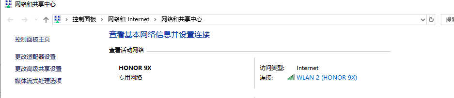

##### 3) 开启Internet连接共享

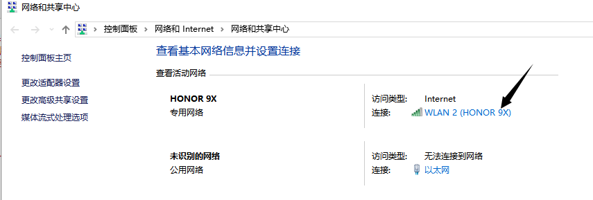
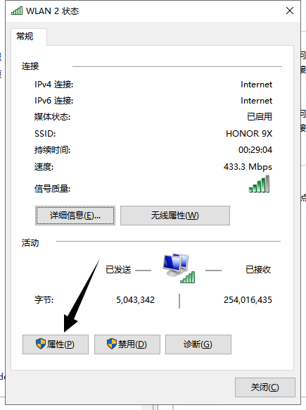
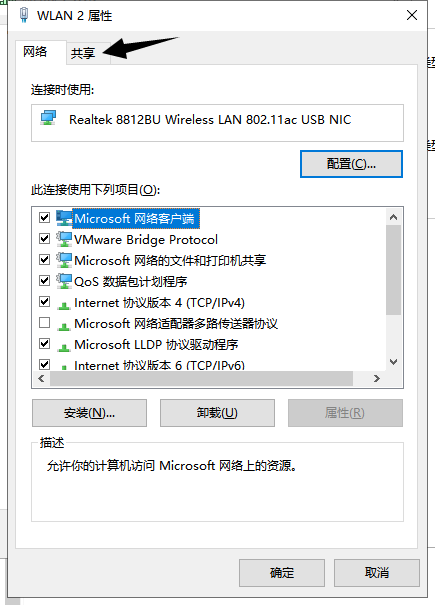
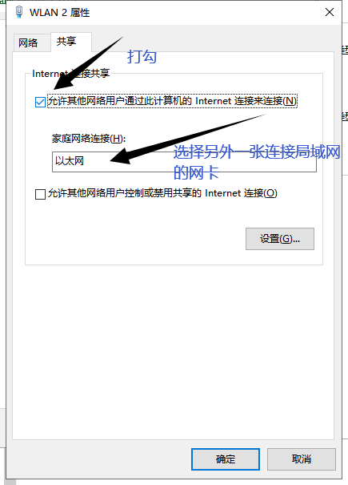

##### 3) 记录连接局域网的网卡自动产生的IP地址

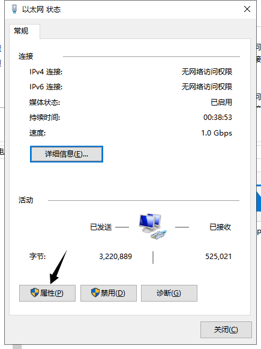
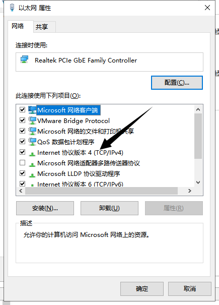
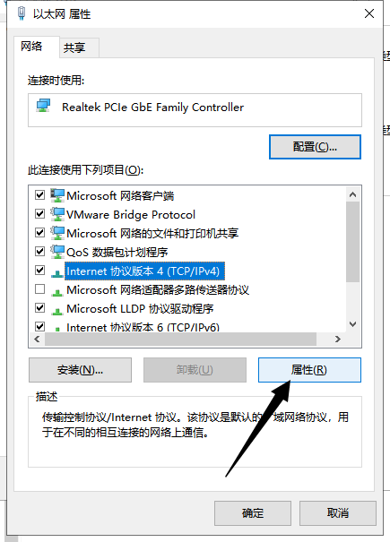
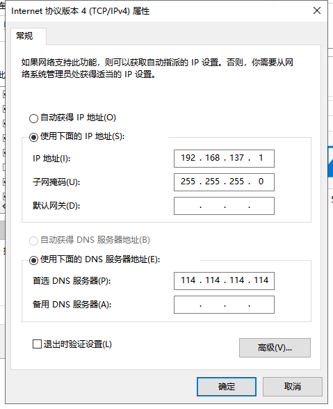

---------------------------------------
## 二、 客户机配置
### 1. 当Ubuntu16.04（带GUI）时

1）执行下列代码打开文件

    sudo vi /etc/network/interfaces

2）根据下图输入内容
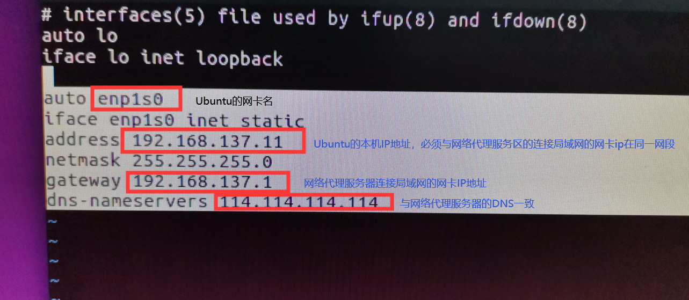

3）重启生效

4）配置网络代理设置

> 桌面->系统设置->网络->网络代理

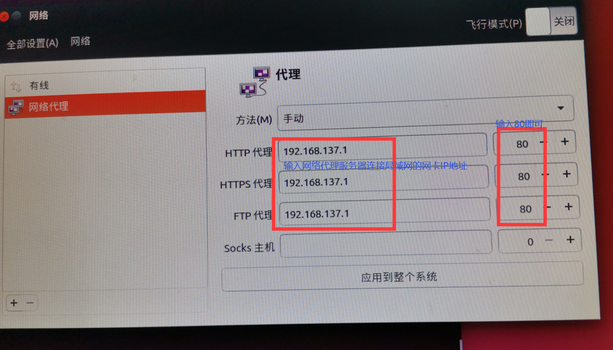

5）检查

5.1 执行 

	ping www.baidu.com

5.2 使用浏览器打开百度首页

> 若能ping通 www.baidu.com 但浏览器打不开则
> 打开浏览器->首选项->高级->网络->连接->设置->不使用代理->确定

----------------------------------
------------------------------

[注]：参考连接链接
[https://zhidao.baidu.com/question/24432176.html](https://zhidao.baidu.com/question/24432176.html)

[https://wk.baidu.com/view/42ee4b2be2bd960590c6770d?ivk_sa=1023194j](https://wk.baidu.com/view/42ee4b2be2bd960590c6770d?ivk_sa=1023194j)

[https://jingyan.baidu.com/article/0eb457e53dcc9e03f1a9058c.html](https://jingyan.baidu.com/article/0eb457e53dcc9e03f1a9058c.html)